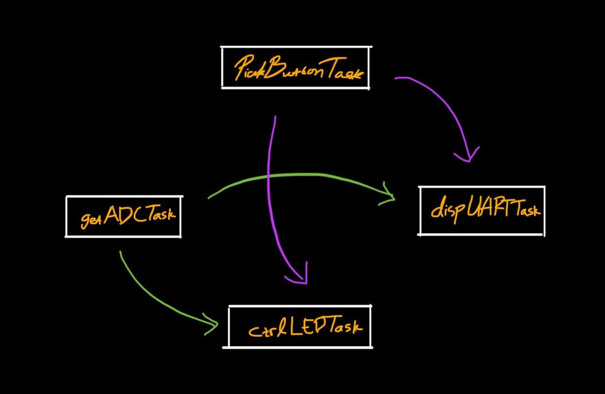

# RTOSIntro

RTOS Introduction with gatTask, pickButton, ctrlLED, dispSerial

This diagram illustrates the relationships between different tasks in an RTOS (Real-Time Operating System) setup:

- **PickButtonTask**: Handles button input
- **getADCTask**: Manages Analog-to-Digital Conversion
- **ctrlLEDTask**: Controls LED output
- **dispUARTTask**: Manages UART display output

The arrows indicate the flow of data or control between these tasks.
